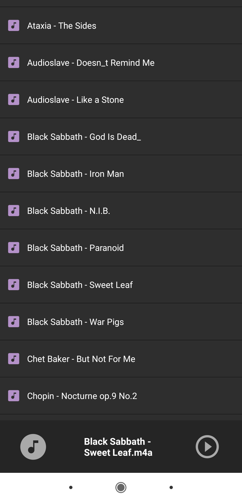

# Chopin Music Player

Nada muito complexo, apenas um aplicativo de música bem simples feito por mim. Utilizei os múdulos expo-media-library e expo-av para fazer a leitura dos arquivos em formato .mp4 e para tocá-los, respectivamente.

